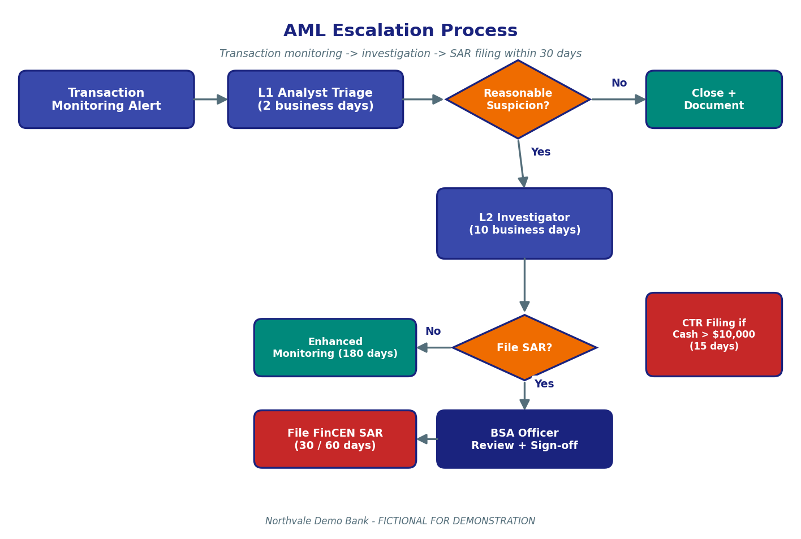

# AML — Anti-Money-Laundering Procedures

> Fictional procedure for the Northvale Demo Bank GenAI RAG capstone demo. Do not use as real banking guidance.

## Summary

This document sets out the Anti-Money-Laundering (AML) procedures by which Northvale Demo Bank ("the Bank") detects, investigates, and reports potential money laundering, terrorist financing, and other financial crime on its books. The procedures implement the Bank's obligations under the U.S. Bank Secrecy Act (BSA) and related regulations, and they pick up where the KYC Customer Onboarding Policy leaves off — the moment an account is activated and ongoing monitoring begins. The Bank operates a hybrid monitoring program that combines (a) rules-based transaction alerts (velocity, structuring, cross-border patterns, dormant-then-active accounts), (b) periodic Customer Due Diligence (CDD) reviews on the same 24-, 12-, and 6-month cadence used for onboarding-time CDD, and (c) quarterly analyst-led portfolio reviews. Alerts are triaged at Level 1 (L1) within 2 business days of generation and, if not closed, escalated to Level 2 (L2) Investigators who complete a case file within 10 business days. Cases that meet the reasonable-suspicion threshold result in a Suspicious Activity Report (SAR) filed with FinCEN within 30 calendar days of detection (60 days if no suspect has been identified). Cash transactions exceeding $10,000 in a single day (or aggregated across same-day related transactions) result in a Currency Transaction Report (CTR) filed within 15 calendar days. Sanctions matches, including Politically Exposed Person (PEP) matches, are handled under the Sanctions Screening Procedures and intersect with this workflow when a sanctions alert is generated against an existing customer. The BSA Officer is the named officer responsible for the Bank's overall AML program and signs off on every SAR before filing.

## Definitions

- **BSA**: Bank Secrecy Act — the underlying U.S. statute requiring AML programs at financial institutions.
- **AML**: Anti-Money-Laundering — the umbrella term for the Bank's monitoring program.
- **SAR (Suspicious Activity Report)**: The report filed with FinCEN when reasonable suspicion of money laundering or related crime is established.
- **CTR (Currency Transaction Report)**: The report filed for cash transactions exceeding $10,000 in a single day.
- **L1 / L2**: Level 1 / Level 2 in the alert escalation hierarchy. L1 Analysts triage; L2 Investigators build the case file.
- **BSA Officer**: The Bank officer designated by the Board as accountable for the AML program; named annually to FinCEN.
- **Reasonable Suspicion**: The investigator's documented belief that a transaction, pattern, or relationship may involve money laundering, terrorism financing, fraud, or other financial crime.
- **Structuring**: The deliberate breaking-up of cash transactions to evade the $10,000 CTR threshold.
- **Look-back Period**: The time window an investigator examines when assessing a pattern, typically 180 days for retail accounts.

## Contents

This page covers (1) the monitoring program and alert sources, (2) the L1 / L2 escalation procedure, (3) the SAR filing workflow and timelines, (4) the CTR filing workflow and timeline, (5) the ongoing CDD review cadence (which mirrors KYC), (6) common scenarios, and (7) frequently asked questions.

## 1. Monitoring Program and Alert Sources

The Bank operates a hybrid AML monitoring program. The rules-based monitoring layer runs daily against the prior day's transactions and generates alerts on four pattern families: velocity (an unusual increase in transaction frequency or volume relative to the customer's baseline), structuring (transactions that appear designed to evade the $10,000 cash-reporting threshold), cross-border patterns (wire transfers to or from FATF high-risk jurisdictions), and dormant-then-active accounts (accounts inactive for more than 180 days that resume activity at material volume). Above and below these rules-based alerts, the Bank conducts quarterly analyst-led portfolio reviews focused on the High-risk customer segment and on any customer with an open enhanced-monitoring flag.

Alerts also arrive from non-monitoring channels: a referral from a Branch Manager, a customer service representative who escalates a complaint that suggests possible fraud (see the Customer Complaint Handling Policy), a Sanctions Analyst who escalates a name match that suggests financial crime beyond the screening list itself, or a third-party tip (regulator, law enforcement, peer institution).

### Key takeaways

- The monitoring program is hybrid: rules-based daily alerts plus analyst-led quarterly reviews.
- Four core rule families: velocity, structuring, cross-border, dormant-then-active.
- Non-monitoring alert channels include branch referrals, complaints, sanctions referrals, and external tips.
- High-risk customers receive additional analyst-led attention every quarter.

### Related Procedures

The KYC risk-rating that drives high-risk attention is documented in [KYC-Customer-Onboarding-Policy.md](KYC-Customer-Onboarding-Policy.md). The sanctions referrals path is documented in [Sanctions-Screening-Procedures.md](Sanctions-Screening-Procedures.md). Complaint-sourced referrals are described in [Customer-Complaint-Handling-Policy.md](Customer-Complaint-Handling-Policy.md).

## 2. L1 / L2 Escalation

Every alert is assigned to a Level 1 (L1) Analyst within one (1) business day of generation and shall be triaged within two (2) business days. The L1 Analyst decides whether the alert is closed at L1 (with a written rationale) or escalated to a Level 2 (L2) Investigator. L2 Investigators have ten (10) business days from receipt to complete a case file and reach one of three outcomes: (a) close with no action, (b) place the customer on enhanced monitoring for a defined period (typically 180 days), or (c) file a Suspicious Activity Report.

The diagram below shows the end-to-end escalation flow. Alerts cleared at L1 are documented and closed. Alerts escalated to L2 either result in enhanced monitoring or a SAR filing. SARs are reviewed and signed off by the BSA Officer before submission to FinCEN. CTR filings run in parallel and are triggered by cash thresholds rather than by the alert pipeline.

### Figure description

The AML escalation diagram shows an alert flowing from the monitoring system into an L1 Analyst triage box, then into an amber diamond labelled "Reasonable Suspicion?". The diamond's "No" branch points right to a teal "Close plus Document" box. The "Yes" branch points down to an L2 Investigator box, then into a second amber diamond labelled "File SAR?". The "No" branch from that diamond points left to a teal "Enhanced Monitoring 180 days" box. The "Yes" branch points further down into a navy "BSA Officer Review plus Sign-off" box and then into a red "File FinCEN SAR (30 / 60 days)" box. A parallel red box on the right captures "CTR Filing if Cash > $10,000 (15 days)", which is triggered independently of the alert pipeline.

### Key takeaways

- L1 triage SLA is 2 business days; L2 case-file SLA is 10 business days.
- L2 outcomes are: close, enhanced monitoring, or SAR.
- The BSA Officer signs off on every SAR before filing.
- CTR filing runs in parallel and is independent of the alert pipeline.

### Related Procedures

The escalation diagram is also embedded in Chapter 3 of the [Compliance Handbook v8](attachments/compliance-handbook-v8.pdf). Where an alert relates to a sanctions match, see [Sanctions-Screening-Procedures.md](Sanctions-Screening-Procedures.md) for the parallel sanctions workflow.

## 3. SAR Filing Workflow and Timelines

The Bank shall file a Suspicious Activity Report (SAR) with FinCEN within thirty (30) calendar days of the date on which the Bank first detects facts that may constitute a basis for filing. Where no suspect has been identified at day 30, the deadline may be extended by an additional thirty (30) days, for a total of sixty (60) calendar days. Detection date is documented in the case file as the date the L1 Analyst first reviewed the alert (for monitoring-sourced cases) or the date the BSA Officer received the referral (for non-monitoring-sourced cases).

The table below summarises the SAR timeline against the parallel CTR timeline. The 30 / 60 / 15 day windows are the canonical filing deadlines for the Bank and are restated identically in Chapter 4 of the Compliance Handbook v8 and in the Complaint Handling policy where complaint-sourced SARs are referenced.

| Report | Trigger | Filing Window from Detection |
|---|---|---|
| SAR (suspect identified) | Reasonable suspicion of financial crime | 30 calendar days |
| SAR (no suspect identified) | Reasonable suspicion, no specific person | 60 calendar days |
| CTR | Cash transactions > $10,000 same day | 15 calendar days |
| Continuing-activity SAR | Continued activity after prior SAR | Every 90 days |

In short, SARs are filed within a month of detection in most cases, the deadline doubles when no suspect is identifiable, and CTRs follow a separate 15-day timeline tied to a hard dollar threshold rather than to suspicion. Continuing-activity SARs are filed every 90 days while the suspicious pattern persists. These figures are stable across this AML page and the Customer Complaint Handling page.

### Key takeaways

- SAR window is 30 calendar days from detection (60 if no suspect).
- CTR window is 15 calendar days from the qualifying cash transaction.
- Continuing-activity SARs are filed every 90 days.
- The BSA Officer signs off on every SAR.

### Related Procedures

Complaints that surface suspected financial crime trigger this SAR workflow — see [Customer-Complaint-Handling-Policy.md](Customer-Complaint-Handling-Policy.md), Section "Complaints That Reveal Suspected Financial Crime", which restates the 30 / 60-day deadlines.

## 4. CTR Filing Workflow

Currency Transaction Reports (CTRs) shall be filed for every cash transaction (single or aggregated same-day transactions by the same customer) exceeding ten thousand dollars ($10,000). Filing shall occur within fifteen (15) calendar days of the qualifying transaction. CTR aggregation considers all cash activity by the same customer across all branches in the same business day, including deposits, withdrawals, and currency exchanges.

CTR filing is a hard regulatory threshold and does not require any subjective judgement of suspicion — the report is filed whenever the threshold is crossed. CTR data is, however, an input into the structuring rule family in the AML monitoring program: a customer who repeatedly transacts at $9,000 to $9,900 cash levels will trigger a structuring alert even though no single transaction crosses the CTR threshold.

### Key takeaways

- The CTR threshold is $10,000 same-day cash, aggregated across all branches.
- CTRs are filed within 15 calendar days.
- CTR is a hard threshold — no suspicion required.
- Apparent structuring around the threshold generates AML alerts under the structuring rule.

### Related Procedures

The CTR threshold and SAR filing windows are restated in Chapter 4 of the [Compliance Handbook v8](attachments/compliance-handbook-v8.pdf).

## 5. Ongoing CDD Review Cadence

After onboarding, the Bank conducts periodic Customer Due Diligence (CDD) reviews on every customer. The cadence is identical to the cadence introduced at onboarding and documented in the KYC policy: every 24 months for Low-risk customers, every 12 months for Medium-risk customers, and every 6 months for High-risk customers receiving Enhanced Due Diligence.

The table below restates the cadence for the AML reader's convenience. The values are identical to those in the KYC policy by design — both pages reference the same canonical cadence.

| Risk Rating | Review Cadence | Refresh Items |
|---|---|---|
| Low | 24 months | ID, address, occupation, expected activity |
| Medium | 12 months | Above + source-of-funds narrative |
| High (EDD) | 6 months | Above + ownership tree + senior sign-off |

The takeaway is that the AML monitoring program is layered on top of the same 24 / 12 / 6 month CDD cycle introduced in KYC; an L2 Investigator examining a customer file will always find a CDD review at most six months (for High-risk) old. Triggers from the monitoring program may also force an ad-hoc CDD reassessment outside the scheduled cadence.

### Key takeaways

- The ongoing CDD cycle is 24 / 12 / 6 months — identical to the cycle introduced in KYC.
- The L2 Investigator can rely on a current CDD file when building any case.
- Monitoring triggers may force an ad-hoc CDD reassessment between scheduled reviews.

### Related Procedures

The original definition and rubric for the CDD risk rating live in [KYC-Customer-Onboarding-Policy.md](KYC-Customer-Onboarding-Policy.md), Section 2. The two pages are intentionally kept in lockstep.

## Common Scenarios

**Scenario A — Velocity alert on a payroll account.** A customer who normally receives one biweekly payroll deposit of $4,200 suddenly receives six deposits totalling $54,000 in a single week. The velocity rule fires. An L1 Analyst reviews the file, sees that the customer recently changed employers and the new employer is paying out historical commissions, and closes the alert at L1 with documentation. No SAR is filed.

**Scenario B — Structuring pattern.** A customer makes daily cash deposits of $9,500 across three different branches over fifteen days. The structuring rule fires after the third day. An L2 Investigator builds the case file, identifies the customer's small business as the source, and finds no plausible business reason for the pattern. A SAR is filed within 30 days of detection. The customer is placed on enhanced monitoring for 180 days. A continuing-activity SAR is filed 90 days later because the pattern persists.

**Scenario C — Cross-border alert on a wire to a high-risk jurisdiction.** A customer wires $48,000 to a counterparty in a FATF-listed high-risk jurisdiction. The cross-border rule fires. The L1 Analyst escalates to L2 because the customer's CDD profile does not include international business. The L2 Investigator requests additional documentation; the customer provides a contract for legitimate import of goods. The case is closed at L2 with enhanced monitoring for 180 days. No SAR is filed.

**Scenario D — CTR with no AML follow-up.** A customer deposits $25,000 in cash at the branch for a verified down-payment on a home. The transaction crosses the $10,000 CTR threshold; a CTR is filed within 15 calendar days. No AML alert is generated because the source of funds and purpose are documented and consistent with the customer's profile. No SAR is filed.

**Scenario E — Complaint-sourced SAR.** A customer files a complaint about unauthorized transactions. The CSR opens a complaint case and, while investigating, observes that the transactions look like a third-party fraud ring rather than an internal error. The case is escalated to an L1 AML Analyst within 2 business days. L1 escalates to L2, who confirms reasonable suspicion. A SAR is filed within 30 calendar days of L1 receipt (the detection date). The customer-facing complaint is resolved separately under the 30-day Complaint Handling resolution target.

### Key takeaways

- Velocity and structuring patterns are the most common alert sources.
- Cross-border patterns frequently close at L2 after documentation review.
- CTRs are filed independently of suspicion.
- Complaint-sourced SARs are common and use the same 30 / 60-day filing window.

### Related Procedures

For the complaint side of Scenario E, see [Customer-Complaint-Handling-Policy.md](Customer-Complaint-Handling-Policy.md).

## FAQ

**Q1. How long does the Bank have to file a SAR?**
30 calendar days from detection, extended to 60 calendar days if no suspect has been identified.

**Q2. What dollar threshold triggers a CTR?**
Any cash transaction or same-day aggregation of cash transactions by the same customer that exceeds $10,000.

**Q3. Who signs off on a SAR before it's filed?**
The BSA Officer signs off on every SAR before submission to FinCEN.

**Q4. What's the difference between L1 and L2?**
L1 Analysts triage alerts within 2 business days. L2 Investigators build full case files within 10 business days when L1 escalates.

**Q5. Are SARs filed even when the customer disputes the transactions?**
Yes. SAR filing is the Bank's regulatory obligation and is not waived by customer dispute. The customer is not informed that a SAR has been filed.

**Q6. What's "structuring"?**
Deliberate breaking-up of cash transactions to evade the $10,000 CTR threshold — for example, repeated cash deposits at $9,500.

**Q7. How often is a customer's risk rating reviewed?**
Every 24 months for Low risk, 12 months for Medium, and 6 months for High. Same cadence as the KYC policy.

**Q8. What's the look-back period for an L2 investigation?**
Typically 180 days for retail accounts, extendable at the L2 Investigator's discretion if the pattern justifies a longer view.

**Q9. Are continuing-activity SARs required?**
Yes. If suspicious activity continues after a SAR has been filed, a continuing-activity SAR is filed every 90 days while the activity persists.

**Q10. Can a Branch Manager close an AML alert directly?**
No. Closures are recorded by L1 Analysts (or by L2 Investigators after escalation). A Branch Manager may submit a referral as input but cannot dispose of an alert.

**Q11. How does this procedure interact with sanctions screening?**
Sanctions and PEP screening run separately and are documented in the Sanctions Screening Procedures page. A sanctions match may also generate an AML referral if the underlying transaction is suspicious.

**Q12. Where is this procedure formally documented for audit?**
Chapter 3 (monitoring) and Chapter 4 (SAR / CTR) of the Compliance Handbook v8 (attached).

## Cross-References

This page is the operational continuation of [KYC-Customer-Onboarding-Policy.md](KYC-Customer-Onboarding-Policy.md) — once an account is open, this is the procedure that monitors it. The CDD review cadence in Section 5 is intentionally identical to the cadence in KYC Section 2. The SAR escalation path in Section 2 is invoked by [Customer-Complaint-Handling-Policy.md](Customer-Complaint-Handling-Policy.md) whenever a complaint reveals suspected financial crime, and the same 30 / 60-day deadlines apply. Sanctions and PEP screening, which intersect with AML investigations through compound alerts, are documented in [Sanctions-Screening-Procedures.md](Sanctions-Screening-Procedures.md).

## Attachments

- [attachments/compliance-handbook-v8.pdf](attachments/compliance-handbook-v8.pdf) — Chapter 3 (monitoring) and Chapter 4 (SAR / CTR) restate this procedure.
- [attachments/regulatory-circular-2026-02.pdf](attachments/regulatory-circular-2026-02.pdf) — Sanctions threshold update that affects AML compound alerts.
- [attachments/aml-escalation-process.png](attachments/aml-escalation-process.png) — The escalation flow diagram embedded above.

## See also

- [KYC Customer Onboarding Policy](KYC-Customer-Onboarding-Policy.md)
- [Sanctions Screening Procedures](Sanctions-Screening-Procedures.md)
- [Customer Complaint Handling Policy](Customer-Complaint-Handling-Policy.md)
- [Home](Home.md)
