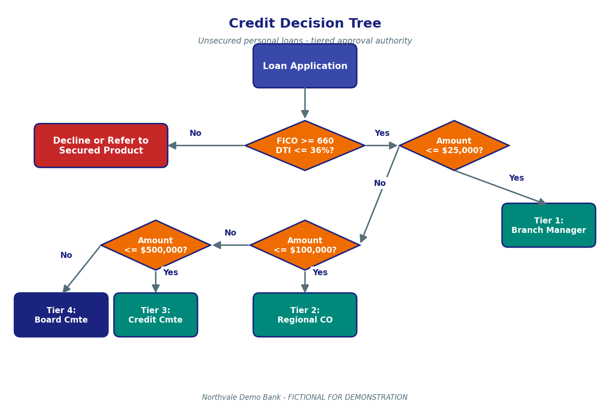

# Credit Risk Assessment Guidelines

> Fictional guidelines for the Northvale Demo Bank GenAI RAG capstone demo. Do not use as real lending guidance.

## Summary

This page sets out Northvale Demo Bank's principles for assessing the credit risk of a retail lending application. It applies to every retail credit product the Bank originates — unsecured personal loans, residential mortgages, Home Equity Lines of Credit (HELOCs), and auto loans — and is the principles-and-thresholds companion to the [Loan Approval Thresholds and Limits page](Loan-Approval-Thresholds-and-Limits.md), which describes who in the Bank has authority to approve loans of various sizes. The guidelines operationalise two principles. First, the Bank lends only where the Borrower demonstrates the **willingness** to repay (evidenced by credit history, including the FICO score, derogatory items, and observed payment patterns). Second, the Bank lends only where the Borrower demonstrates the **capacity** to repay (evidenced by stable income, employment history, and the Debt-to-Income ratio). Collateral is treated as a secondary repayment source and is governed by the Loan-to-Value ratio, but collateral shall not substitute for inadequate capacity. The guidelines further define the product-level thresholds — minimum FICO 660 for unsecured personal loans, 620 for residential mortgages, 700 for prime auto loans; Debt-to-Income ceilings of 36% for unsecured personal loans and 43% for Qualified Mortgages; Loan-to-Value ceilings of 80% for conventional mortgages without Private Mortgage Insurance (PMI), 95% with PMI, and 90% for HELOCs — and lay out the exception-handling framework. Synonyms are used consistently throughout this page and the Loan Approval page: DTI / debt-to-income ratio; LTV / loan-to-value ratio; QM / qualified mortgage; HELOC / home equity line of credit; PMI / private mortgage insurance.

## Definitions

- **FICO**: The standardized U.S. consumer credit score used by the Bank as the willingness indicator.
- **Debt-to-Income Ratio (DTI)**: Total monthly debt service obligations divided by gross monthly income. Used as the capacity indicator.
- **Loan-to-Value Ratio (LTV)**: Loan amount divided by the appraised value of the collateral. Used as the collateral coverage indicator.
- **Qualified Mortgage (QM)**: A residential mortgage that meets the Ability-to-Repay rule and the 43% DTI ceiling; receives Bank's "safe-harbor" treatment.
- **HELOC**: Home Equity Line of Credit, secured by junior lien on a primary residence.
- **PMI**: Private Mortgage Insurance, required when conventional mortgage LTV exceeds 80%.
- **Compensating Factors**: Documented mitigants that may justify an exception (liquid reserves, guarantor, lower LTV, etc.).
- **Related Party**: A Bank officer, director, or immediate family member of either.
- **Exception**: Any credit decision that deviates from the standard scoring criteria or the standard tier limits.

## Contents

This page covers (1) the underwriting principles of willingness and capacity, (2) the product-level scoring criteria, (3) the credit decision tree with diagram, (4) exception handling and compensating factors, (5) Debt-to-Income guidance with detailed table, (6) common scenarios, and (7) frequently asked questions.

## 1. Underwriting Principles

The Bank shall extend credit only where the Borrower demonstrates both the willingness and the capacity to repay. **Willingness** is evidenced primarily by the FICO score, supplemented by an inspection of derogatory items (charge-offs, collections, judgements, bankruptcies) and observed payment patterns over the prior 24 months. **Capacity** is evidenced primarily by gross monthly income, employment stability (length of current employment, industry, and trend), and the Debt-to-Income ratio. **Collateral**, where applicable, is a secondary repayment source: the Bank may foreclose, repossess, or otherwise realise collateral if the Borrower defaults, but the existence of collateral does not by itself justify lending to a Borrower who lacks capacity.

Every credit decision shall be documented in a written credit memorandum that addresses (a) the Borrower's character and credit history, (b) capacity as measured by income and DTI, (c) collateral coverage as measured by LTV (for secured products), and (d) any compensating factors. The credit memorandum is the audit-facing artefact for every decision the Bank reaches.

### Key takeaways

- Lending requires both willingness and capacity to repay.
- Willingness is indicated by FICO and credit history; capacity by DTI and income.
- Collateral is a secondary repayment source, not a substitute for capacity.
- Every decision produces a written credit memorandum.

### Related Procedures

The approval authority that signs the credit memorandum is defined in [Loan-Approval-Thresholds-and-Limits.md](Loan-Approval-Thresholds-and-Limits.md). The desk-level companion procedure is the [Credit Officer Decision Framework](attachments/credit-officer-decision-framework.docx).

## 2. Product-Level Scoring Criteria

The Bank's minimum scoring criteria are summarised in the table below. The unsecured personal loan minimum FICO is 660 with a DTI ceiling of 36% — a co-signer is required if FICO is between 660 and 700. Residential mortgage origination requires a minimum FICO of 620 and complies with Qualified Mortgage rules including the 43% DTI ceiling and the 80% / 95% LTV ceiling (95% requires PMI). HELOCs require a minimum FICO of 680, a 43% DTI ceiling, and a 90% combined LTV (including any first-lien mortgage on the property). Prime auto loans require a minimum FICO of 700, a 40% DTI ceiling, and an LTV ceiling of 110% of invoice price.

| Product | Min FICO | Max DTI | Max LTV | Notes |
|---|---|---|---|---|
| Unsecured personal loan | 660 | 36% | n/a | Co-signer required below FICO 700 |
| Residential mortgage (QM) | 620 | 43% | 80% / 95% with PMI | QM safe harbor |
| HELOC | 680 | 43% | 90% combined | Includes first-lien mortgage |
| Prime auto loan | 700 | 40% | 110% invoice | Max term 72 months |
| Subprime auto loan | 580 | 45% | 120% invoice | Senior approval required |

The takeaway is that the unsecured 36% DTI and the QM 43% DTI are the canonical capacity ceilings for retail credit, and the 80% / 95% LTV split (with PMI) is the canonical capacity ceiling for collateral. Applications that fall short of these minimums may proceed only as documented exceptions per Section 4. These thresholds are restated identically in Chapter 2 of the [Credit Policy Manual](attachments/credit-policy-manual.pdf) and in the Loan Approval Thresholds page.

### Key takeaways

- Minimum FICO is 660 unsecured, 620 mortgage, 700 prime auto.
- DTI ceilings are 36% unsecured, 43% QM mortgage, 43% HELOC, 40% prime auto.
- LTV ceilings are 80% conventional (95% with PMI), 90% HELOC, 110% prime auto.
- All thresholds are the same in this page, the Loan Approval page, and the Credit Policy Manual.

### Related Procedures

Applications that fall short of these thresholds with compensating factors are escalated under the procedure in [Loan-Approval-Thresholds-and-Limits.md](Loan-Approval-Thresholds-and-Limits.md), Section "Exception Handling".

## 3. Credit Decision Tree

The Bank's standard credit decision is a two-step tree. Step 1 is the FICO-and-DTI gate: the application is declined or referred to a secured product if FICO is below the product minimum or DTI is above the product ceiling. Step 2 routes the application to the correct approval tier based on the requested loan amount, which is the subject of the Loan Approval page. The diagram below shows the tree for unsecured personal loans.

### Figure description

The credit decision tree diagram starts with a top blue box labelled "Loan Application" feeding into an amber diamond "FICO >= 660 and DTI <= 36%?". The diamond's "No" branch points left to a red box "Decline or Refer to Secured Product". The "Yes" branch points right into a second amber diamond "Amount <= $25,000?". The "Yes" branch from that diamond points down to a teal box "Tier 1: Branch Manager Approval"; the "No" branch leads to a third diamond "Amount <= $100,000?" → "Tier 2: Regional Credit Officer", then a fourth diamond "Amount <= $500,000?" → "Tier 3: Credit Committee", and finally to a navy box "Tier 4: Board Credit Committee" for any amount above $500,000.

### Key takeaways

- Step 1 of the tree is the credit gate (FICO and DTI).
- Step 2 of the tree is the amount-based tier routing.
- Failed Step 1 leads to decline or referral, not just to a higher tier.
- The same diagram is reused on the Loan Approval page.

### Related Procedures

The amount-based tier routing in Step 2 is the subject of [Loan-Approval-Thresholds-and-Limits.md](Loan-Approval-Thresholds-and-Limits.md). The diagram is also embedded in Section 4 of the [Credit Policy Manual](attachments/credit-policy-manual.pdf).

## 4. Exception Handling and Compensating Factors

An exception is any credit decision that deviates from the scoring criteria in Section 2 or the tier limits in the Loan Approval page. Every exception shall be (a) approved one tier above the tier that would normally hold authority, (b) documented in the Exception Log, and (c) reviewed in aggregate by the Credit Committee on a quarterly basis. The Bank's annual exception rate ceiling is five percent (5%) of all originations; exceeding that ceiling triggers a portfolio review by the Chief Credit Officer.

Permissible compensating factors include: documented liquid reserves greater than twelve (12) months of debt service, a guarantor with a minimum FICO of 740, a loan-to-value ratio below 60% on a secured product, or a documented borrower-specific factor (recent inheritance, sale of a business, etc.). Compensating factors shall be evidenced in the credit file and referenced in the credit memorandum.

### Key takeaways

- Exceptions are approved one tier higher than the normal authority.
- Quarterly Credit Committee review of the Exception Log is mandatory.
- The annual exception rate ceiling is 5% of all originations.
- Three named compensating factors: 12-month reserves, FICO 740 guarantor, LTV below 60%.

### Related Procedures

The escalation procedure for an exception is documented in [Loan-Approval-Thresholds-and-Limits.md](Loan-Approval-Thresholds-and-Limits.md). The Exception Log template is in the [Credit Officer Decision Framework](attachments/credit-officer-decision-framework.docx).

## 5. Debt-to-Income Guidance

The Debt-to-Income ratio (DTI) is the single most important capacity indicator. DTI is calculated as the sum of all monthly debt obligations — including the proposed new loan payment — divided by the Borrower's gross monthly income. The table below sets out the DTI ceilings the Bank applies by product. Applicants above the ceiling may proceed only as documented exceptions.

| Product | DTI Ceiling | Notes |
|---|---|---|
| Unsecured personal loan | 36% | Hard ceiling — exception requires Tier 2 approval |
| Residential mortgage (QM) | 43% | QM safe-harbor; non-QM mortgages have no fixed ceiling but require Tier 3 |
| HELOC | 43% | Same as QM |
| Prime auto loan | 40% | |
| Subprime auto loan | 45% | Senior approval required regardless |

The 36% and 43% values are the canonical DTI ceilings used throughout the Bank's documentation. They appear with identical numeric values in this Credit Risk Assessment page, in the [Loan Approval Thresholds and Limits page](Loan-Approval-Thresholds-and-Limits.md), and in Chapter 2 of the [Credit Policy Manual](attachments/credit-policy-manual.pdf). When asked about DTI, the Bank's RAG assistant should be able to return either the canonical 36% / 43% pair or the full table.

### Key takeaways

- Unsecured personal loan DTI ceiling is 36%.
- QM mortgage and HELOC DTI ceiling is 43%.
- DTI includes the proposed new loan payment.
- DTI is calculated on gross monthly income.

### Related Procedures

DTI is one of the inputs to the tier-routing logic in [Loan-Approval-Thresholds-and-Limits.md](Loan-Approval-Thresholds-and-Limits.md). Both pages cite identical 36% / 43% ceilings.

## Common Scenarios

**Scenario A — Standard unsecured personal loan approval.** A salaried customer applies for a $15,000 unsecured personal loan. FICO is 720; DTI including the new loan is 28%. The application passes the Step 1 gate. The amount routes to Tier 1 (Branch Manager). Approval is granted in two business days. No exception is required.

**Scenario B — DTI just over the ceiling.** A self-employed customer applies for a $50,000 unsecured personal loan. FICO is 750. DTI is 39% — three percentage points over the 36% unsecured ceiling. The Branch Manager identifies twelve months of liquid reserves as a compensating factor, logs the exception, and routes the file to the Regional Credit Officer (Tier 2). The Regional Credit Officer approves; the exception is logged for the next quarterly Credit Committee review.

**Scenario C — Decline.** A customer applies for a $10,000 unsecured loan. FICO is 640 — below the 660 minimum. The Branch Manager declines and refers the customer to a secured product (e.g., a credit-builder loan secured by a savings deposit).

**Scenario D — QM mortgage at 43% DTI exactly.** A customer applies for a $400,000 residential mortgage. FICO is 700; DTI is exactly 43%; LTV is 95% (with PMI). The application passes the Step 1 gate (43% is the ceiling, not the threshold) and routes to Tier 2 because the amount is between $100k and $500k. Tier 2 approves. The credit memorandum documents the 43% DTI as at-ceiling and confirms QM safe-harbor treatment.

**Scenario E — HELOC with combined LTV above ceiling.** A customer applies for a $50,000 HELOC on a primary residence valued at $600,000 with an existing first-lien mortgage of $510,000. Combined LTV would be $560,000 / $600,000 = 93%, above the 90% HELOC ceiling. The application is declined unless compensating factors are documented; in this case the customer has only 4 months of liquid reserves and no eligible guarantor. The application is declined.

### Key takeaways

- Most applications pass the gate cleanly; tier routing then runs as usual.
- DTI exceptions are the most common type, and require one-tier-up approval.
- Sub-minimum FICO is typically declined or referred to a secured product.
- HELOC combined-LTV failures are common and rarely succeed without strong compensating factors.

### Related Procedures

For the approval steps once an application passes the gate, see [Loan-Approval-Thresholds-and-Limits.md](Loan-Approval-Thresholds-and-Limits.md).

## FAQ

**Q1. What is the minimum FICO score for an unsecured personal loan?**
660. A co-signer is required if the applicant's FICO is between 660 and 700.

**Q2. What is the minimum FICO for a mortgage?**
620, with the application complying with Qualified Mortgage (QM) rules including the 43% DTI ceiling.

**Q3. What is the maximum DTI for an unsecured personal loan?**
36%. The same 36% ceiling appears in the Loan Approval page.

**Q4. What is the maximum DTI for a Qualified Mortgage?**
43%. Same value referenced in the Loan Approval page and the Credit Policy Manual.

**Q5. What is the maximum LTV for a conventional mortgage?**
80% without PMI, or 95% with PMI.

**Q6. What is the maximum LTV for a HELOC?**
90% combined — including the first-lien mortgage balance on the property.

**Q7. How is DTI calculated?**
Sum of all monthly debt obligations (including the proposed new loan payment) divided by gross monthly income.

**Q8. What's an exception, and who approves it?**
An exception is any deviation from the scoring criteria or tier limits. Exceptions are approved one tier above the normal authority and reviewed quarterly by the Credit Committee.

**Q9. What is the Bank's annual exception rate ceiling?**
5% of all originations.

**Q10. What are the standard compensating factors?**
Twelve months of liquid reserves; a guarantor with FICO 740 or higher; LTV below 60% on a secured product.

**Q11. Can collateral compensate for inadequate capacity?**
No. Collateral is a secondary repayment source. The Bank requires both willingness and capacity; collateral alone does not justify lending.

**Q12. Where is this guidance formally documented for audit?**
The Credit Policy Manual (attached) is the audit-facing artefact. This wiki page is the operational summary.

## Cross-References

This page and [Loan-Approval-Thresholds-and-Limits.md](Loan-Approval-Thresholds-and-Limits.md) are a pair — one defines the credit gates, the other defines the approval authority. The 36% and 43% DTI ceilings appear in both pages with identical values by design; an RAG assistant should be able to retrieve either page when asked about DTI. The credit decision tree diagram appears in both pages and in the Credit Policy Manual. Applicant identity and CDD risk rating, which feed into the application packet, are documented in [KYC-Customer-Onboarding-Policy.md](KYC-Customer-Onboarding-Policy.md). Complaints from declined applicants follow [Customer-Complaint-Handling-Policy.md](Customer-Complaint-Handling-Policy.md).

## Attachments

- [attachments/credit-policy-manual.pdf](attachments/credit-policy-manual.pdf) — Sections 1–7 cover principles, scoring, tiers, decision tree, exceptions, monitoring, and glossary.
- [attachments/credit-officer-decision-framework.docx](attachments/credit-officer-decision-framework.docx) — Desk-level companion procedure with the Exception Log template.
- [attachments/credit-decision-tree.png](attachments/credit-decision-tree.png) — The decision-tree diagram embedded above.

## See also

- [Loan Approval Thresholds and Limits](Loan-Approval-Thresholds-and-Limits.md)
- [KYC Customer Onboarding Policy](KYC-Customer-Onboarding-Policy.md)
- [Customer Complaint Handling Policy](Customer-Complaint-Handling-Policy.md)
- [Home](Home.md)
