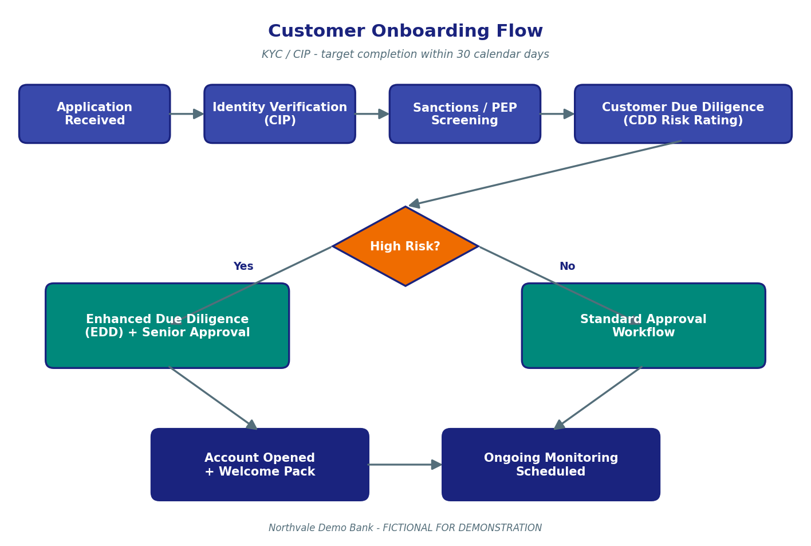

# KYC — Customer Onboarding Policy

> Fictional policy for the Northvale Demo Bank GenAI RAG capstone demo. Do not use as real banking guidance.

## Summary

This policy governs how Northvale Demo Bank ("the Bank") identifies, verifies, risk-rates, and onboards every new retail customer. It is also known by its U.S. regulatory name — the Customer Identification Program (CIP) — and is the customer-facing component of the Bank's broader Know-Your-Customer (KYC) framework. The policy applies to every natural person and legal entity opening any deposit account, loan account, or service relationship with the Bank, whether through a branch, online channel, or the mobile app. At account opening the Bank shall collect and verify the legal name, date of birth, residential address, and government-issued identification number of the applicant. The CIP shall be completed within 30 calendar days of the Account Opening Date. Concurrently, the Bank shall perform Customer Due Diligence (CDD) and assign each new customer a risk rating of Low, Medium, or High. High-risk customers — including Politically Exposed Persons (PEPs), customers from high-risk jurisdictions, and customers presenting unusual cash patterns — are subject to Enhanced Due Diligence (EDD) including source-of-funds narrative, ownership tree mapping, and senior compliance sign-off. The CDD risk rating drives the subsequent periodic review cadence: every 24 months for low-risk, every 12 months for medium-risk, and every 6 months for high-risk customers. Sanctions and PEP screening run in real time at account opening and are described in the Sanctions Screening Procedures page. Ongoing transaction monitoring after the account is open is covered by the AML procedures page. This policy is consolidated into Chapter 1 and Chapter 2 of the Compliance Handbook v8.

## Definitions

- **Account Opening Date**: The calendar date on which an account is first activated in the Bank's core banking system.
- **CIP (Customer Identification Program)**: The U.S. regulatory term for the identity-collection-and-verification step performed at account opening.
- **Customer Due Diligence (CDD)**: The risk-rating exercise performed at onboarding and refreshed periodically.
- **Enhanced Due Diligence (EDD)**: The deeper review applied to high-risk customers.
- **CDD Risk Rating**: One of {Low, Medium, High}; drives review cadence and documentation depth.
- **PEP (Politically Exposed Person)**: A current or former senior public figure, an immediate family member, or a known close associate.
- **High-Risk Jurisdiction**: A jurisdiction listed by FATF as a "Jurisdiction under Increased Monitoring" or "High-Risk Jurisdiction".
- **Beneficial Owner**: Any natural person who owns 25% or more of a legal-entity customer, or who exercises significant control.
- **Onboarding Channel**: One of {branch, online, mobile, partner referral}.

## Contents

This page covers (1) the Customer Identification Program and the 30-day completion window, (2) the CDD risk-rating model and review cadence, (3) Enhanced Due Diligence for high-risk customers, (4) PEP screening at account opening, (5) the end-to-end onboarding flow with diagram, (6) common scenarios, and (7) frequently asked questions.

## 1. Customer Identification Program (CIP)

The Bank shall, at account opening, collect from every applicant: (a) legal name as it appears on government-issued identification, (b) date of birth, (c) current residential address, and (d) a government-issued identification number. For U.S. persons this is the Social Security Number (SSN). For non-U.S. persons it is a passport number or other Bank-approved identification number. The Bank shall verify each data point either documentarily (review of an unexpired identification document) or non-documentarily (electronic identity verification against a Bank-approved data provider), or both.

CIP shall be completed within thirty (30) calendar days of the Account Opening Date. Where verification cannot be completed within the thirty-day window, the relationship shall be escalated to the Branch Manager. If verification remains incomplete at sixty (60) calendar days, the account shall be restricted (no debit activity permitted) and closed in accordance with the Account Closure Procedure.

### Key takeaways

- The Bank shall complete CIP within 30 calendar days of the Account Opening Date.
- The four required data points are legal name, date of birth, residential address, and identification number.
- Verification may be documentary, non-documentary, or both.
- Accounts not verified by day 60 shall be restricted and closed.

### Related Procedures

For sanctions and PEP screening that runs in parallel with CIP, see [Sanctions-Screening-Procedures.md](Sanctions-Screening-Procedures.md). For the ongoing transaction monitoring that begins once CIP completes, see [AML-Anti-Money-Laundering-Procedures.md](AML-Anti-Money-Laundering-Procedures.md). The CIP narrative is also documented in Chapter 1 of the [Compliance Handbook v8](attachments/compliance-handbook-v8.pdf).

## 2. Customer Due Diligence and Risk Rating

At account opening the Bank shall assign each Customer a CDD Risk Rating of Low, Medium, or High. The rating is based on a documented rubric that considers customer type (natural person vs. legal entity), occupation or business activity, expected transaction volume and pattern, geographic exposure (country of residence and country of significant business activity), and product mix. The rating shall be re-validated at every periodic review and may be adjusted up or down based on observed transaction behavior.

The CDD risk rating drives the periodic review cadence. The table below sets out the review cadence and the minimum documentation refresh required at each review.

| Risk Rating | Review Cadence | Documentation Refreshed at Each Review |
|---|---|---|
| Low (standard) | Every 24 months | ID, residential address, occupation, expected activity |
| Medium | Every 12 months | Above + updated source-of-funds narrative |
| High (EDD) | Every 6 months | Above + ownership tree + senior compliance sign-off |

In summary, low-risk customers receive the lightest-touch review on a two-year cycle, medium-risk customers are reviewed annually with an additional source-of-funds narrative, and high-risk customers are subject to a six-monthly Enhanced Due Diligence cycle that adds the ownership tree and senior sign-off. The 24/12/6-month cadence is the canonical cadence used consistently across this KYC policy and the AML procedures page, and is also documented in Chapter 2 of the Compliance Handbook v8.

### Key takeaways

- Every Customer receives a Low / Medium / High CDD risk rating at onboarding.
- Review cadence is 24 / 12 / 6 months, respectively.
- Documentation requirements deepen with each step up in risk rating.
- Risk ratings may be adjusted between scheduled reviews based on transaction behavior.

### Related Procedures

Ongoing transaction monitoring that may trigger an ad-hoc CDD reassessment is described in [AML-Anti-Money-Laundering-Procedures.md](AML-Anti-Money-Laundering-Procedures.md). The 24/12/6-month cadence is restated identically there.

## 3. Enhanced Due Diligence (EDD)

EDD applies to every customer with a High CDD risk rating. EDD shall be performed at onboarding for any customer who, on initial assessment, meets any of the following: is a Politically Exposed Person (PEP) or an immediate family member of a PEP, is resident or substantively active in a High-Risk Jurisdiction, presents unusual cash patterns (e.g., expected cash deposits exceeding $25,000 per month), or is a legal entity with opaque ownership.

EDD adds three artefacts on top of standard CDD: (a) a source-of-funds narrative documenting how the customer acquired their wealth and the funds expected to flow through the account, (b) an ownership tree for legal-entity customers mapping every Beneficial Owner above the 25% threshold, and (c) a sign-off by a Regional Compliance Officer or higher. EDD customers shall be re-screened against sanctions and PEP lists at the start of every six-monthly review, not only at onboarding.

### Key takeaways

- EDD is mandatory for every High-rated customer.
- The three EDD artefacts are source-of-funds narrative, ownership tree, and senior compliance sign-off.
- EDD customers are re-screened at every 6-month review.
- PEPs and customers from FATF high-risk jurisdictions are automatically EDD.

### Related Procedures

For the screening engine that identifies PEPs and sanctions matches, see [Sanctions-Screening-Procedures.md](Sanctions-Screening-Procedures.md). For the operational implementation of EDD at the desk level, see the [Credit Officer Decision Framework](attachments/credit-officer-decision-framework.docx) where lending applications from EDD customers are routed to a higher approval tier.

## 4. PEP Screening at Account Opening

Every applicant — natural person or legal-entity beneficial owner — shall be screened against the Bank's PEP list at account opening. The Bank uses a third-party vendor PEP list that is refreshed daily. Potential PEP matches shall be reviewed by a Tier 1 Sanctions Analyst within four (4) business hours of alert generation. Confirmed PEP matches result in an automatic CDD risk rating of High and trigger EDD.

PEP screening at onboarding is one of two PEP-screening touchpoints in the Bank's operations. The other is ongoing PEP screening, which runs daily against the entire customer base; that ongoing process is documented in the Sanctions Screening Procedures page. Both touchpoints use the same vendor list, the same daily refresh cadence, and the same four-business-hour match-review SLA.

### Key takeaways

- Every applicant is PEP-screened at onboarding.
- The vendor PEP list refreshes daily.
- Potential matches are reviewed within 4 business hours.
- Confirmed PEPs become High-risk customers and receive EDD.

### Related Procedures

For ongoing PEP screening of the existing customer base, see [Sanctions-Screening-Procedures.md](Sanctions-Screening-Procedures.md). The daily refresh and 4-hour SLA are restated identically in that page.

## 5. End-to-End Onboarding Flow

The Bank's onboarding flow consists of four sequential gates followed by a high-risk routing decision. The four gates are: application receipt, identity verification (CIP), real-time sanctions and PEP screening, and CDD risk rating assignment. After the four gates, applicants identified as High risk are routed to the EDD workflow with senior sign-off, while Low and Medium risk applicants flow through the standard approval workflow. All approved files end in two parallel artefacts: account activation in the core banking system and scheduling of the first periodic review (at 24, 12, or 6 months from the activation date).

### Figure description

The onboarding flow diagram shows a left-to-right pipeline of four blue boxes — Application Received, Identity Verification (CIP), Sanctions and PEP Screening, and Customer Due Diligence Risk Rating — followed by an amber diamond labelled "High Risk?". The diamond's "Yes" branch points down-left to a teal box labelled "Enhanced Due Diligence plus Senior Approval", and its "No" branch points down-right to a teal box labelled "Standard Approval Workflow". Both teal boxes converge into two dark-navy boxes at the bottom of the diagram — "Account Opened plus Welcome Pack" and "Ongoing Monitoring Scheduled". The figure illustrates that every onboarding file passes through the same four gates regardless of risk, and that the risk rating determines only the depth of the subsequent review, not whether onboarding occurs.

### Key takeaways

- The four onboarding gates are CIP, sanctions/PEP screening, CDD risk rating, and high-risk routing.
- High-risk customers route through EDD; low and medium route through standard approval.
- Account activation and first periodic review scheduling are simultaneous final steps.

### Related Procedures

The same diagram appears in Chapter 1 of the [Compliance Handbook v8](attachments/compliance-handbook-v8.pdf). The screening gate is detailed in [Sanctions-Screening-Procedures.md](Sanctions-Screening-Procedures.md).

## Common Scenarios

**Scenario A — Standard low-risk customer.** A salaried employee walks into a branch to open a personal checking account. The Personal Banker collects the four CIP data points, runs documentary verification of a driver's license, and submits the application. Sanctions and PEP screening return clean within seconds. The CDD risk rating is calculated as Low based on customer type (natural person), occupation (salaried), and expected activity (regular payroll deposits, debit card use). The account is activated the same day, and the first periodic review is scheduled 24 months out.

**Scenario B — Self-employed customer with cash-heavy business.** A self-employed restaurant owner opens both a business checking account and a personal savings account. CIP collects the four data points and verifies them documentarily. The expected cash deposit volume exceeds $25,000 per month, so the rubric flags the file as Medium risk; the Personal Banker collects a brief source-of-funds narrative as part of the standard CDD process. Sanctions and PEP screening return clean. The accounts are activated, and the first periodic review is scheduled 12 months out.

**Scenario C — Confirmed PEP.** A non-U.S. national applies online for a savings account. PEP screening flags a high-confidence match against a former senior public official in their country of residence. A Tier 1 Sanctions Analyst reviews and confirms the match within 4 business hours. The CDD risk rating is set to High. EDD is initiated: the customer is asked to provide a source-of-funds narrative, an ownership tree for any associated legal entities, and supporting documentation. A Regional Compliance Officer signs off on the EDD file before the account is activated. The first periodic review is scheduled 6 months out, and the customer is re-screened against the PEP list at that review.

**Scenario D — CIP not completed in 30 days.** A customer opens an account online but the non-documentary identity verification provider returns "no match". The Bank attempts documentary verification by mail. At day 30 the identification document has still not been received. The Branch Manager is notified and reaches out to the customer. The document arrives at day 45 and verification completes. Had it not arrived by day 60, the account would have been restricted and closed.

**Scenario E — Legal entity with opaque ownership.** A new small business applies to open a checking account. The applicant's filings disclose two beneficial owners each holding 50%, but the Bank's verification reveals a third party who appears to exercise significant control. The CDD risk rating is set to High and EDD is initiated. The ownership tree is mapped, the third party is identified as a Beneficial Owner, and that individual is then CIP-verified and PEP-screened. The account is activated only after the full beneficial-ownership chain is documented.

### Key takeaways

- Most low-risk individuals onboard within a single branch visit.
- Cash-heavy small businesses typically become Medium risk and require a source-of-funds narrative.
- Confirmed PEPs trigger EDD and senior sign-off before account activation.
- The 30/60-day window is a hard backstop — accounts close at day 60 without verification.

### Related Procedures

Lending applications from any of these customer types are evaluated under [Credit-Risk-Assessment-Guidelines.md](Credit-Risk-Assessment-Guidelines.md) and routed via [Loan-Approval-Thresholds-and-Limits.md](Loan-Approval-Thresholds-and-Limits.md).

## FAQ

**Q1. How long does the Bank have to complete identity verification for a new account?**
The Bank has 30 calendar days from the Account Opening Date to complete the Customer Identification Program (CIP). If verification is not complete by day 60, the account is restricted and closed.

**Q2. What information does CIP collect?**
Legal name, date of birth, residential address, and a government-issued identification number (SSN for U.S. persons; passport or other approved ID for non-U.S. persons).

**Q3. What's the difference between CDD and EDD?**
CDD is the standard risk-rating exercise performed on every new customer. EDD is the deeper review applied to customers rated High — it adds a source-of-funds narrative, an ownership tree, and senior compliance sign-off.

**Q4. How often is a customer's CDD risk rating reviewed?**
Every 24 months for Low-risk customers, every 12 months for Medium-risk customers, and every 6 months for High-risk customers. The cadence is the same in this policy and in the AML procedures.

**Q5. What makes a customer High risk?**
Confirmed PEP status, residence or significant activity in a High-Risk Jurisdiction, unusual cash patterns (e.g., expected cash > $25,000 per month), opaque legal-entity ownership, or any combination of these factors.

**Q6. Who can sign off on an EDD file?**
A Regional Compliance Officer or higher. Branch Managers cannot sign off on EDD files.

**Q7. How fast must a PEP match be reviewed?**
Within 4 business hours of alert generation. The same SLA applies to sanctions matches.

**Q8. Are PEP lists rechecked after the customer is onboarded?**
Yes. The Bank runs daily PEP and sanctions screening against the full customer base — see the Sanctions Screening Procedures page.

**Q9. Can a customer open an account without an SSN?**
Yes, if the customer is a non-U.S. person, the Bank may accept a passport or another approved identification number. The CIP data-point requirements still apply.

**Q10. What happens if a customer's CDD risk rating changes between reviews?**
The Bank may adjust the rating ad hoc — for example, after observing transaction patterns that don't match the expected profile. An ad-hoc upgrade to High triggers EDD immediately.

**Q11. Does this policy apply to existing customers who add a new product?**
The Bank does not repeat CIP for existing customers in good standing, but it does refresh CDD if the new product materially changes the expected activity (e.g., adding a wire-transfer service to a previously deposit-only relationship).

**Q12. Where is this policy formally documented for auditors?**
This policy is restated in Chapter 1 and Chapter 2 of the Compliance Handbook v8 (attached). The Handbook is the audit-facing artefact; this wiki page is the operational summary.

## Cross-References

This policy is most tightly coupled with [Sanctions-Screening-Procedures.md](Sanctions-Screening-Procedures.md), which describes the screening engine that runs at onboarding and on the existing customer base; both pages use the same daily PEP list refresh, the same 4-business-hour SLA, and the same 85% Jaro-Winkler threshold for sanctions matching. It is also tightly coupled with [AML-Anti-Money-Laundering-Procedures.md](AML-Anti-Money-Laundering-Procedures.md), which begins where this policy ends — the moment the account is activated — and uses the identical 24/12/6-month CDD review cadence. Lending applications from new customers are governed by [Credit-Risk-Assessment-Guidelines.md](Credit-Risk-Assessment-Guidelines.md) and [Loan-Approval-Thresholds-and-Limits.md](Loan-Approval-Thresholds-and-Limits.md).

## Attachments

- [attachments/compliance-handbook-v8.pdf](attachments/compliance-handbook-v8.pdf) — Chapter 1 (CIP) and Chapter 2 (CDD) restate this policy.
- [attachments/quarterly-compliance-update-q1-2026.docx](attachments/quarterly-compliance-update-q1-2026.docx) — Q1 2026 KYC completion-rate metrics and EDD training reminders.
- [attachments/onboarding-flow.png](attachments/onboarding-flow.png) — The onboarding flow diagram embedded above.

## See also

- [AML Procedures](AML-Anti-Money-Laundering-Procedures.md)
- [Sanctions Screening Procedures](Sanctions-Screening-Procedures.md)
- [Credit Risk Assessment Guidelines](Credit-Risk-Assessment-Guidelines.md)
- [Customer Complaint Handling Policy](Customer-Complaint-Handling-Policy.md)
- [Home](Home.md)
