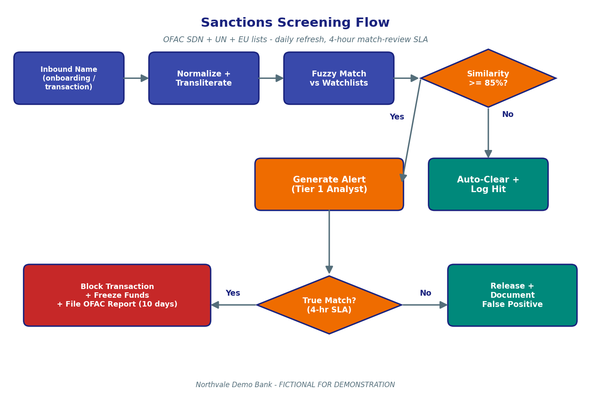

# Sanctions Screening Procedures

> Fictional procedure for the Northvale Demo Bank GenAI RAG capstone demo. Do not use as real sanctions guidance.

## Summary

This procedure governs how Northvale Demo Bank ("the Bank") screens customers and transactions against U.S., U.N., and E.U. sanctions lists and against a third-party Politically Exposed Persons (PEP) list. Screening runs in three contexts: (a) real-time at onboarding, before account activation; (b) real-time at every transaction (incoming and outgoing wires, ACH, card authorisations); and (c) batch overnight against the full customer base. The Bank uses the OFAC Specially Designated Nationals (SDN) list, the U.N. consolidated sanctions list, and the E.U. consolidated sanctions list as its three primary sanctions sources, refreshed daily. PEP screening runs against a daily-refreshed vendor list. The Bank's screening engine uses a Jaro-Winkler string-similarity algorithm with a similarity threshold of 85% — this threshold was updated from 80% to 85% effective March 1, 2026 by Regulatory Circular 2026-02 to reduce the false-positive rate. Potential matches (similarity >= 85%) generate alerts that shall be reviewed by a Tier 1 Sanctions Analyst within four (4) business hours. True matches result in blocked transactions, frozen funds, and an OFAC report filed within ten (10) calendar days. False positives are documented and the case closed. Compound matches (concurrent PEP and sanctions match on the same name) route directly to a Tier 2 Sanctions Investigator. PEP screening procedures intersect with the KYC Customer Onboarding Policy at the moment of account opening; both pages cite identical daily refresh cadence and the identical 4-business-hour match-review SLA.

## Definitions

- **OFAC**: Office of Foreign Assets Control — the U.S. Treasury agency that maintains the SDN list and administers U.S. sanctions programmes.
- **SDN List**: Specially Designated Nationals and Blocked Persons List — OFAC's primary sanctions list.
- **U.N. Consolidated List**: The United Nations Security Council Consolidated List of sanctions targets.
- **E.U. Consolidated List**: The European Union's consolidated financial sanctions list.
- **PEP (Politically Exposed Person)**: A current or former senior public figure, an immediate family member, or a known close associate.
- **Jaro-Winkler**: The string-similarity algorithm used by the Bank's screening engine.
- **Similarity Threshold**: The minimum Jaro-Winkler score that triggers an alert; currently 85%.
- **True Match**: A potential match confirmed by analyst review to be the same individual or entity on the list.
- **False Positive**: A potential match cleared by analyst review.
- **Compound Match**: Concurrent PEP and sanctions match on the same name.
- **OFAC Report**: A blocked-transaction report submitted to OFAC for every confirmed sanctions match.

## Contents

This page covers (1) the lists screened, (2) the screening engine and the 85% Jaro-Winkler threshold, (3) the four-business-hour match-review SLA, (4) the end-to-end screening flow with diagram, (5) PEP screening (the cross-reference with KYC), (6) compound matches and Tier 2 escalation, (7) OFAC reporting after a true match, (8) common scenarios, and (9) frequently asked questions.

## 1. Lists Screened

The Bank screens against three sanctions lists and one PEP list. All four lists refresh daily from authoritative sources. The table below summarises the lists, their sources, and the screening contexts in which they apply.

| List | Source | Refresh | Used At |
|---|---|---|---|
| OFAC SDN List | U.S. Treasury / OFAC | Daily | Onboarding, transactions, batch |
| U.N. Consolidated List | United Nations Security Council | Daily | Onboarding, transactions, batch |
| E.U. Consolidated List | European External Action Service | Daily | Onboarding, transactions, batch |
| PEP List (vendor) | Third-party vendor | Daily | Onboarding, batch |

The takeaway is that the Bank applies a four-source screening stack — three sanctions lists plus a PEP list — all refreshed daily and applied at onboarding and overnight batch. Sanctions lists additionally apply to every transaction in real-time. PEP screening at the transaction level is not run because PEP status alone is not a blocking condition for a transaction (it is, however, a risk-rating input for CDD).

### Key takeaways

- Three sanctions lists: OFAC SDN, U.N. consolidated, E.U. consolidated.
- One PEP list from a third-party vendor.
- All four lists refresh daily.
- Sanctions screen at every transaction; PEP screens only at onboarding and overnight.

### Related Procedures

The PEP touchpoint at account opening is also documented in [KYC-Customer-Onboarding-Policy.md](KYC-Customer-Onboarding-Policy.md), Section 4 — both pages cite the same daily refresh cadence.

## 2. Screening Engine and the 85% Jaro-Winkler Threshold

The Bank's screening engine uses a Jaro-Winkler string-similarity algorithm to fuzzy-match inbound names (customer names at onboarding; counterparty names on transactions) against the four lists. Names are first normalised — case folded, punctuation stripped, transliterated from non-Latin scripts where applicable — and then compared character-by-character against every entry in the active lists.

The similarity threshold is **85%**. A Jaro-Winkler score of 85% or higher generates an alert. The threshold was updated from 80% to 85% effective March 1, 2026 by Regulatory Circular 2026-02; the rationale was a Q4 2025 calibration exercise that found a false-positive rate of approximately 18% at the previous threshold. The new threshold reduced the false-positive rate by an estimated 40% without measurably increasing the false-negative rate.

### Key takeaways

- Algorithm: Jaro-Winkler string similarity.
- Threshold: 85% similarity (effective March 1, 2026).
- Previous threshold of 80% was retired by Regulatory Circular 2026-02.
- Names are normalised and transliterated before comparison.

### Related Procedures

The threshold-change rollout schedule is documented in [Regulatory Circular 2026-02](attachments/regulatory-circular-2026-02.pdf); new onboarding cut over on March 1, 2026, existing customer rescreening between March 15 and April 30, and legacy batches by April 30.

## 3. Four-Business-Hour Match-Review SLA

Every potential match generated by the screening engine shall be reviewed by a Tier 1 Sanctions Analyst within four (4) business hours of alert generation. Business hours are defined as 8:00 AM to 6:00 PM Eastern Time, Monday through Friday, excluding U.S. federal holidays. Alerts generated outside business hours start the SLA clock at the next business-hour boundary.

During the four-hour window the Analyst shall (a) inspect the inbound name and the list-entry name side-by-side, (b) review available identifying metadata (date of birth, place of birth, identification number, address, alias names), (c) consult the underlying list source, and (d) reach one of two dispositions — **True Match** or **False Positive**. Where the Analyst cannot reach a confident disposition in the four-hour window, the case is escalated to a Tier 2 Sanctions Investigator and the four-hour clock applies to the first Tier 2 review rather than to final disposition.

### Key takeaways

- SLA: 4 business hours from alert generation.
- Business hours: 8 AM - 6 PM Eastern, Monday-Friday, excluding U.S. federal holidays.
- Outcome: True Match or False Positive.
- Inconclusive cases escalate to Tier 2 within the same 4-hour clock.

### Related Procedures

The same 4-business-hour SLA applies to PEP matches at onboarding — see [KYC-Customer-Onboarding-Policy.md](KYC-Customer-Onboarding-Policy.md), Section 4.

## 4. End-to-End Screening Flow

The diagram below shows the screening flow from inbound name to disposition. Inbound names are normalised, fuzzy-matched, scored, alerted if at or above the 85% threshold, and reviewed by a Tier 1 Analyst within the four-business-hour SLA. True matches result in transaction blocks, fund freezes, and OFAC reports. False positives are documented and cleared.

### Figure description

The sanctions screening flow diagram shows a left-to-right pipeline beginning with an "Inbound Name" blue box (the input from onboarding or a transaction). The name then passes through a "Normalise plus Transliterate" blue box, into a "Fuzzy Match vs Watchlists" blue box, and into an amber decision diamond labelled "Similarity >= 85%?". The "No" branch from that diamond points down to a teal "Auto-Clear plus Log Hit" box (no human review). The "Yes" branch points down to an amber "Generate Alert (Tier 1 Analyst)" box, which feeds into a second amber diamond "True Match? (4-hour SLA)". The "Yes" branch from that diamond points left to a red box "Block Transaction plus Freeze Funds plus File OFAC Report (10 days)". The "No" branch points right to a teal "Release plus Document False Positive" box. The figure illustrates that the 85% threshold is the only gate between machine matching and human review, and that the 4-hour SLA applies to the human-review step.

### Key takeaways

- Names are normalised before fuzzy matching.
- The 85% threshold is the alert gate.
- Tier 1 Analyst review SLA is 4 business hours.
- True matches block, freeze, and file; false positives clear and document.

### Related Procedures

The diagram is also embedded in Section 2 of [Regulatory Circular 2026-02](attachments/regulatory-circular-2026-02.pdf).

## 5. PEP Screening

The Bank screens every applicant — natural person and legal-entity beneficial owner — against a third-party PEP list at account opening, and rescreens the entire customer base against the same list overnight every day. The PEP list refreshes daily from the vendor. Potential PEP matches follow the same review pipeline as sanctions matches and are reviewed by a Tier 1 Analyst within 4 business hours.

Confirmed PEPs are flagged in the Bank's core system. The flag automatically sets the customer's CDD risk rating to High and triggers Enhanced Due Diligence (EDD) per the KYC Customer Onboarding Policy. The PEP touchpoint at onboarding is described identically in both pages — same vendor list, same daily refresh, same 4-business-hour SLA — by design. This is the canonical PEP-screening procedure across the Bank's documentation.

### Key takeaways

- PEP screening runs at onboarding and in overnight batch.
- Vendor PEP list refreshes daily.
- 4-business-hour SLA for analyst review.
- Confirmed PEPs receive High CDD risk rating and EDD.

### Related Procedures

PEP at onboarding is documented in [KYC-Customer-Onboarding-Policy.md](KYC-Customer-Onboarding-Policy.md), Section 4. CDD risk rating and EDD are covered in KYC Sections 2 and 3.

## 6. Compound Matches and Tier 2 Escalation

A compound match occurs when the screening engine returns a potential PEP match and a potential sanctions match on the same inbound name (or on overlapping identifiers — e.g., a date of birth that matches both lists' entries). Compound matches route directly to a Tier 2 Sanctions Investigator and skip Tier 1 triage. The four-business-hour SLA applies to the first Tier 2 review rather than to final disposition.

Tier 2 Investigators have ten (10) business days from receipt to reach final disposition on a compound match. The disposition options are the same as for single matches — True Match (with block, freeze, and OFAC report) or False Positive (with documentation and clearance). Where both halves of the compound resolve to True Match, the customer is reported to OFAC and frozen, and the CDD risk rating is automatically set to High with EDD initiated.

### Key takeaways

- Compound match = concurrent PEP + sanctions match on the same name.
- Compound matches route directly to Tier 2.
- Tier 2 final disposition: 10 business days.
- Compound true matches trigger block, freeze, OFAC report, and EDD.

### Related Procedures

Tier 2 procedures mirror the AML L2 procedures in [AML-Anti-Money-Laundering-Procedures.md](AML-Anti-Money-Laundering-Procedures.md), Section 2.

## 7. OFAC Reporting After a True Match

When a sanctions match is confirmed as a True Match, the Bank shall: (a) block the in-progress transaction, (b) freeze any related funds in the customer's accounts, (c) file an OFAC report describing the blocked transaction and the underlying customer relationship within ten (10) calendar days of the True Match disposition, and (d) preserve the customer's full file for OFAC follow-up. The Bank shall not release the blocked funds or close the relationship without explicit OFAC authorisation.

For U.N. and E.U. matches that are not concurrently OFAC-listed, the Bank applies analogous procedures: blocking, freezing, and a report to the Office of the Chief Compliance Officer who in turn coordinates the appropriate filing with U.N. or E.U. authorities. In all cases the customer is not informed of the block or report.

### Key takeaways

- True Match triggers block, freeze, and OFAC report within 10 calendar days.
- Funds may not be released without OFAC authorisation.
- U.N. / E.U. matches follow analogous procedures.
- Customer is not informed of the block or the report.

### Related Procedures

The 10-day OFAC reporting window is also restated in Section 2 of [Regulatory Circular 2026-02](attachments/regulatory-circular-2026-02.pdf).

## Common Scenarios

**Scenario A — Onboarding clean.** An applicant's name passes through real-time screening. The engine returns a top similarity score of 71% against an SDN entry — below the 85% threshold. No alert is generated. The applicant proceeds through onboarding.

**Scenario B — Sanctions false positive at 88%.** An applicant's common name returns an 88% match against an SDN entry. A Tier 1 Sanctions Analyst reviews and finds that the SDN entry refers to a different individual with a different date of birth and place of birth. The case is documented as a False Positive and cleared within 90 minutes — well within the 4-hour SLA. Onboarding proceeds.

**Scenario C — Sanctions true match.** A transaction arrives with a counterparty name that returns a 93% match against an SDN entry, with matching date of birth and country. The Tier 1 Analyst reviews and confirms the True Match within 2 hours. The transaction is blocked, related funds in the customer's accounts are frozen, and an OFAC report is filed at day 6. The customer is not informed.

**Scenario D — Compound match.** An onboarding applicant returns simultaneously an 89% sanctions match (E.U. list) and a 91% PEP match. The case routes directly to a Tier 2 Sanctions Investigator. Investigation concludes at day 7 that the PEP match is a True Match (a former regional official) and the sanctions match is a False Positive (a different listed individual). The customer is onboarded with a High CDD risk rating and EDD; no block or freeze is applied.

**Scenario E — Cutover-day issue under the new 85% threshold.** On March 1, 2026 — the day the new 85% threshold takes effect — the alert volume drops by approximately 35% relative to the prior week. A handful of alerts that would have fired at 82% under the old threshold do not fire under the new one; sample reviews of these dropped alerts by the Tier 2 team confirm all would have been False Positives. The Q1 2026 Quarterly Compliance Update reports the cutover as completed without operational incident.

### Key takeaways

- Scores below 85% generate no alert and no human review.
- Most alerts above 85% resolve as False Positives within the 4-hour SLA.
- True matches trigger blocks, freezes, and OFAC reports within 10 calendar days.
- Compound matches always go to Tier 2.

### Related Procedures

For complaints from customers whose transactions are blocked at the counterparty stage, see [Customer-Complaint-Handling-Policy.md](Customer-Complaint-Handling-Policy.md).

## FAQ

**Q1. What sanctions lists does the Bank screen against?**
The OFAC SDN list, the U.N. consolidated list, and the E.U. consolidated list. All refresh daily.

**Q2. Does the Bank screen for PEPs?**
Yes — using a third-party PEP list that refreshes daily. Screening runs at onboarding and overnight.

**Q3. What's the Bank's fuzzy-match threshold?**
85% Jaro-Winkler similarity. The threshold was raised from 80% to 85% effective March 1, 2026 by Regulatory Circular 2026-02.

**Q4. How fast must a potential match be reviewed?**
Within 4 business hours of alert generation. Same SLA for sanctions and PEP matches.

**Q5. Who reviews sanctions alerts?**
Tier 1 Sanctions Analysts. Inconclusive cases escalate to Tier 2 Sanctions Investigators.

**Q6. What happens if a sanctions match is confirmed?**
The transaction is blocked, related funds are frozen, and an OFAC report is filed within 10 calendar days.

**Q7. What's a compound match?**
A concurrent PEP and sanctions match on the same name. Compound matches route directly to Tier 2 and skip Tier 1 triage.

**Q8. Is the customer told that their funds were blocked?**
The customer is not told the reason for the block, and is never told that an OFAC report was filed.

**Q9. Why was the threshold raised to 85%?**
A Q4 2025 calibration exercise found a roughly 18% false-positive rate at 80%. Moving to 85% reduced false positives by approximately 40% without measurable change in false negatives.

**Q10. Does PEP status block a transaction?**
No. PEP status drives CDD risk rating and EDD, but does not block transactions. Only confirmed sanctions matches block.

**Q11. Where is this procedure formally documented?**
The Compliance Handbook v8 references this procedure; Regulatory Circular 2026-02 contains the threshold update.

**Q12. What's the relationship between this page and the KYC page on PEP screening?**
The two pages describe the same PEP touchpoint at onboarding. Both cite identical daily list refresh and identical 4-business-hour SLA.

## Cross-References

The PEP screening section of this page is the canonical reference for PEP procedures, and it is intentionally mirrored in [KYC-Customer-Onboarding-Policy.md](KYC-Customer-Onboarding-Policy.md), Section 4 — both pages cite identical daily list refresh and 4-business-hour SLA. A sanctions match against an existing customer may generate a parallel AML referral; the AML side is documented in [AML-Anti-Money-Laundering-Procedures.md](AML-Anti-Money-Laundering-Procedures.md). Customer complaints about blocked or held transactions follow [Customer-Complaint-Handling-Policy.md](Customer-Complaint-Handling-Policy.md) but the underlying sanctions disposition is never disclosed to the customer.

## Attachments

- [attachments/regulatory-circular-2026-02.pdf](attachments/regulatory-circular-2026-02.pdf) — Contains the threshold update from 80% to 85% and the cutover schedule.
- [attachments/compliance-handbook-v8.pdf](attachments/compliance-handbook-v8.pdf) — References this procedure in the financial-crime appendix.
- [attachments/sanctions-screening-flow.png](attachments/sanctions-screening-flow.png) — The screening flow diagram embedded above.

## See also

- [KYC Customer Onboarding Policy](KYC-Customer-Onboarding-Policy.md)
- [AML Anti-Money-Laundering Procedures](AML-Anti-Money-Laundering-Procedures.md)
- [Customer Complaint Handling Policy](Customer-Complaint-Handling-Policy.md)
- [Home](Home.md)
